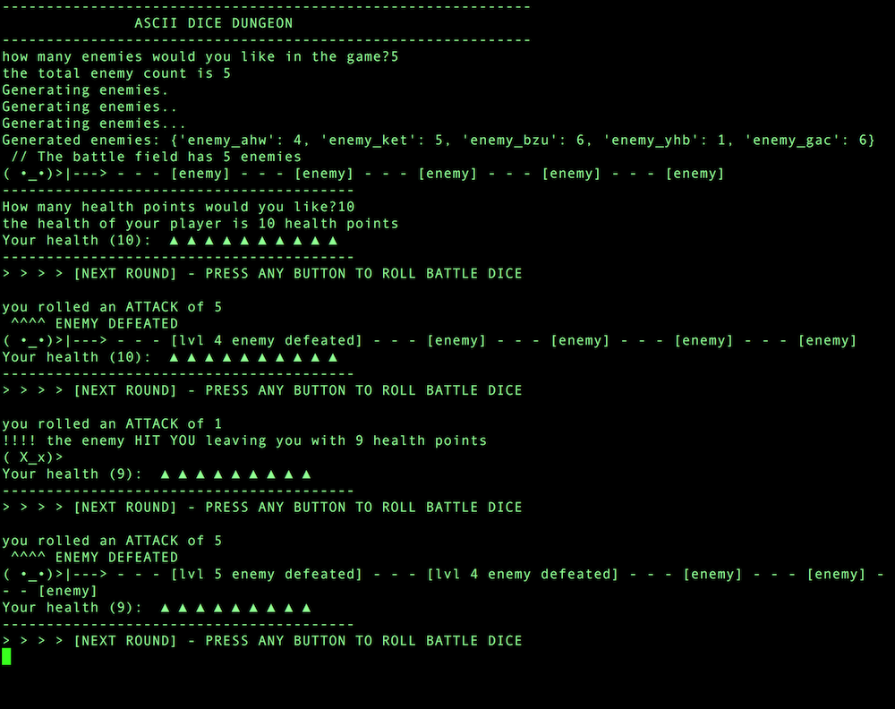

# ASCII DICE DUNGEON

Simple ascii dice game that runs in the terminal. You choose you defeat enemies by rolling a dice. 
If your dice roll is the same as the enemies health of higher (in a range from 1 to 6), the enemy is deafeated. 
Win the game by deafting all of the enemies before your health reaches zero

## Purpose of software

ASCII Dice Dungeon was made from a very traditional gaming concept: two dice competing against one another. 
I have always found these types of games enjoyable and relatively mind numbing (which can be therapeutic at times),
therefore, I decided to create one. There are very simple ascii graphics making it a little more visual.
   

## Installation
[1] - Download via git:
```bash
https://github.com/lukeguthmann/ascii_dice_dungeon.git
```

## Usage
1. Open terminal
2. Change into cloned directory:
```bash
cd ascii_dice_dungeon
```
3. Run python script: 
```bash
python3 ASCII_DICE_DUNGEON.py
```
4. Exit script by pressing ```ctrl + c```


## Program screnshot.



